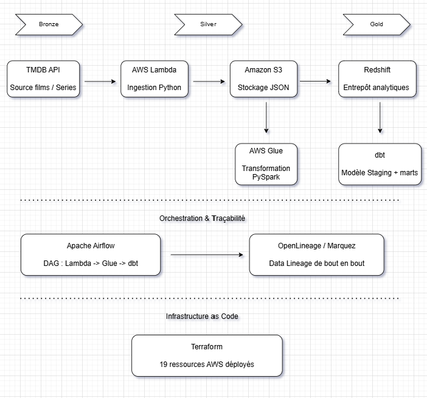
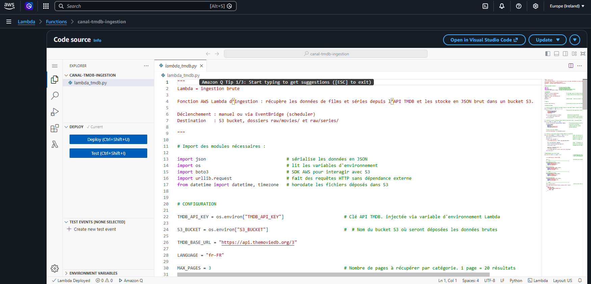
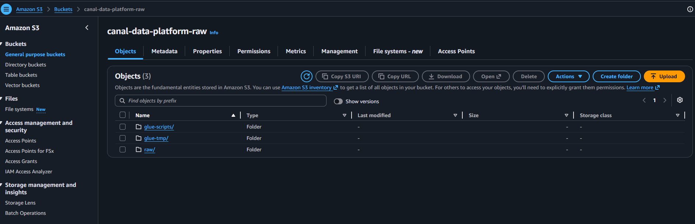
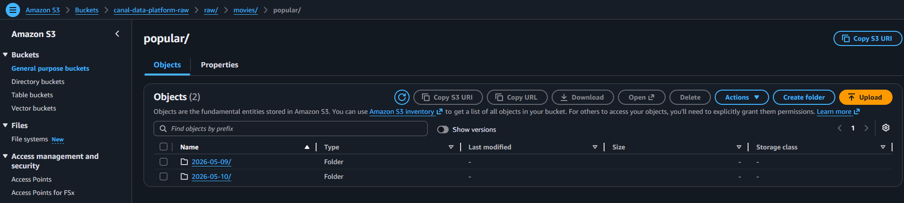
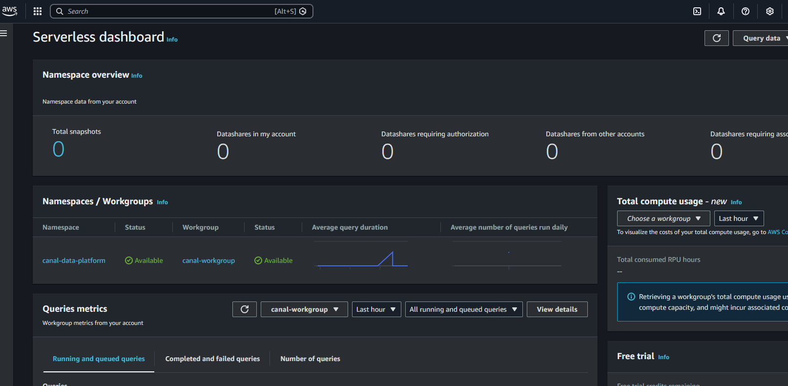
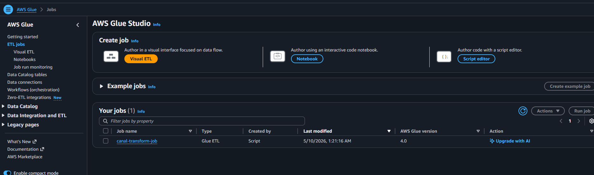
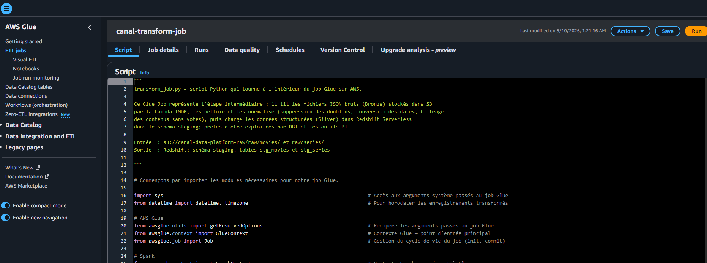

# Canal Data Platform

Projet personnel réalisé dans le cadre de ma montée en compétence en Data Engineering.

L'idée de départ était simple : construire un pipeline de données complet sur AWS, 
du début à la fin, en utilisant les mêmes outils que les équipes data en entreprise. 
Les données viennent de l'API TMDB (The Movie Database), films et séries, ce qui colle 
bien au contexte d'une entreprise comme Canal+.

---

## Ce que fait ce projet

Les données de films et séries sont récupérées depuis l'API TMDB et stockées brutes dans S3.
Elles sont ensuite transformées via AWS Glue, chargées dans Redshift puis modélisées avec dbt 
pour produire des tables analytiques exploitables. Tout le pipeline est orchestré par Airflow 
et chaque mouvement de données est tracé via OpenLineage (standard ouvert de traçabilité des données) 
et visualisé dans Marquez (interface graphique qui affiche le chemin complet des données).

Le pipeline suit une logique Bronze / Silver / Gold :

    Ingestion Lambda (Bronze)
         |
    Stockage brut S3 (Bronze)
         |
    Transformation Glue (Silver)
         |
    Entrepôt Redshift (Silver)
         |
    Modélisation dbt (Gold)
         |
    Orchestration Airflow
         |
    Data Lineage OpenLineage / Marquez

---

## Stack technique

- **AWS Lambda** : ingestion des données depuis l'API TMDB vers S3
- **Amazon S3** : stockage des données brutes en JSON
- **AWS Glue** : transformation et nettoyage des données (PySpark)
- **Amazon Redshift Serverless** : entrepôt de données analytique
- **dbt** : modélisation SQL, tests de qualité des données
- **Apache Airflow** : orchestration du pipeline
- **OpenLineage / Marquez** : data lineage (traçabilité des données)
- **Terraform** : infrastructure as code pour provisionner les ressources AWS
- **Python** : Lambda, Glue, tests unitaires

---

## Structure du projet

    canal-data-platform/
    |
    |-- ingestion/
    |   |-- lambda_tmdb.py        Fonction Lambda qui appelle l'API TMDB et dépose les données dans S3
    |   |-- test_local.py         Tests unitaires pour valider la Lambda en local avant déploiement
    |   |-- deploy_lambda.sh      Script de déploiement : zip du code et terraform apply
    |
    |-- glue/
    |   |-- transform_job.py      Job Glue : lit le JSON brut depuis S3, nettoie et charge dans Redshift
    |   |-- setup_redshift.sql    Script SQL pour créer le schéma staging et les tables dans Redshift
    |
    |-- dbt/
    |   |-- dbt_project.yml       Configuration principale du projet dbt
    |   |-- models/
    |       |-- staging/
    |       |   |-- stg_movies.sql      Modèle staging des films
    |       |   |-- stg_series.sql      Modèle staging des séries
    |       |   |-- sources.yml         Déclaration des sources et tests de qualité
    |       |-- mart/
    |           |-- fct_top_content.sql     Top contenus films et séries classés par note
    |           |-- dim_languages.sql       Dimension des langues du catalogue
    |
    |-- dags/
    |   |-- canal_pipeline.py     DAG Airflow qui orchestre Lambda, Glue et dbt dans le bon ordre
    |
    |-- terraform/
    |   |-- main.tf               Configuration du provider AWS et des variables
    |   |-- s3.tf                 Bucket S3 avec versioning, chiffrement et lifecycle
    |   |-- iam.tf                Rôles IAM et politiques de sécurité pour Lambda et Glue
    |   |-- redshift.tf           Redshift Serverless, job Glue et connexion VPC
    |
    |-- docker-compose.yml        Lance Airflow et Marquez en local via Docker

---

## Architecture

---

## État du projet

### En production sur AWS
- Lambda `canal-tmdb-ingestion` : ingère 240 résultats par exécution
- S3 `canal-data-platform-raw` : 24 fichiers JSON déposés
- Redshift Serverless `canal-workgroup` : statut AVAILABLE
- Glue Job `canal-transform-job` : déployé, connexion Redshift établie
- Glue Connection `canal-redshift-connection` : VPC configuré
- Terraform : 19 ressources déployées en une commande

### En cours de finalisation
- Job Glue : problème de compatibilité de types entre Spark et Redshift en cours de résolution
- Airflow : DAG écrit et configuré pas encore lancé
- OpenLineage / Marquez : configurés dans le docker-compose pas encore lancés
- dbt : modèles écrits, connexion à Redshift à finaliser

---

## Projet en production sur AWS

### Lambda - canal-tmdb-ingestion

### S3 - canal-data-platform-raw

### S3 - Données brutes ingérées

### Redshift Serverless - canal-workgroup

### Glue Job - canal-transform-job

---

## Lancer le projet en local

### Prérequis

- AWS CLI configuré
- Terraform version 1.3 minimum
- Python 3.12
- Docker et Docker Compose
- Une clé API TMDB gratuite sur themoviedb.org

### 1. Configurer les variables d'environnement

Créer un fichier `.env` à la racine du projet :

    TMDB_API_KEY = votre_clé_ici
    S3_BUCKET = canal-data-platform-raw

Créer un fichier `terraform/terraform.tfvars` :

    tmdb_api_key      = "votre_clé_ici"
    redshift_user     = "admin"
    redshift_password = "votre_mot_de_passe"

### 2. Tester la Lambda en local

    export $(cat .env | xargs)
    cd ingestion && python3 test_local.py

### 3. Déployer l'infrastructure AWS

    bash ingestion/deploy_lambda.sh

### 4. Lancer Airflow et Marquez via Docker

    docker-compose up -d

    Interface Airflow : http://localhost:8080  (admin / admin)
    Interface Marquez : http://localhost:3000

---

## Estimation des coûts AWS

Ce projet a été conçu pour rester dans les limites du free tier AWS autant que possible.

| Service              | Coût estimé |
|----------------------|-------------|
| S3                   | 0 EUR       |
| Lambda               | 0 EUR       |
| Glue                 | 1 à 2 EUR   |
| Redshift Serverless  | 3 à 5 EUR   |
| Total                | moins de 10 EUR |

---

## Ce que j'ai appris

Ce projet m'a permis de vraiment comprendre des concepts que je connaissais surtout en théorie.

Le Bronze / Silver / Gold par exemple : je savais ce que c'était mais le construire étape par étape m'a montré pourquoi cette séparation existe concrètement.
Pour Airflow, j'ai écrit le DAG complet qui orchestre Lambda, Glue et dbt avec les dépendances entre tâches et les règles de retry. Je n'ai pas encore eu le temps de le lancer, c'est la prochaine étape.
Terraform m'a vraiment convaincu de l'importance de l'Infrastructure as Code. Sans lui, je devrais recliquer dans la console AWS à chaque modification.
Avec dbt j'ai mis en pratique ce que je connaissais déjà (modéliser en SQL avec les couches staging et mart) et configurer des tests de qualité automatiques.
Le Data Lineage m'a appris qu'en entreprise, une donnée incorrecte sans traçabilité peut faire perdre des heures. C'est pour ça que c'est une priorité dans les équipes data matures.

Enfin le principe du moindre privilège : chaque service AWS n'a que les permissions strictement nécessaires. C'est une pratique de sécurité fondamentale que j'ai appliquée dès le début.
